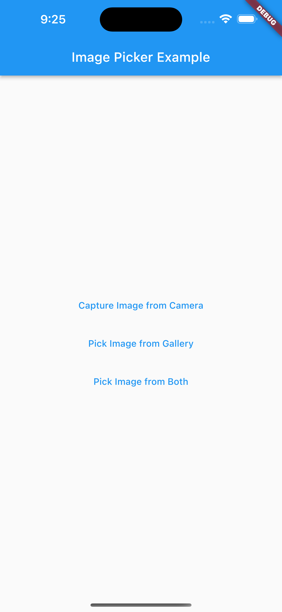
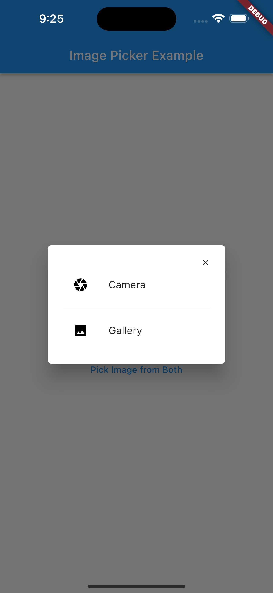

# Camera Gallery Image Picker

A Flutter package that provides a simple and customizable way to capture images from the camera and pick image from gallery and both from camera and gallery at the same time.

## Platform Support

| Android | iOS | macOS | Web | Linux | Windows |
|---------|-----|-------|-----|-------|---------|
| ✔       | ✔   | :x:   | :x: | :x:   | :x:     |

## Installation

Add the following dependency to your `pubspec.yaml` file:

```yaml
dependencies:
  camera_gallery_image_picker: ^0.0.2
```

Then, run `flutter pub get` to install the package.

## IOS
Add following keys to your `info.plist` file:

```
 <key>NSCameraUsageDescription</key>
 <string>Describe why yo need camera permission</string>
 <key>NSPhotoLibraryUsageDescription</key>
 <string>Describe why you need photo library permission</string>
```

## Android
No any configuration is required.

## Usage
Import the package:
```dart
import 'package:camera_gallery_image_picker/camera_gallery_image_picker.dart';
```


## Screenshots

&nbsp


## Example
```dart

import 'package:camera_gallery_image_picker/camera_gallery_image_picker.dart';

/// CAPTURE AND PICK IMAGE FROM CAMERA
final File? _imageFile = await CameraGalleryImagePicker.pickImageFromCamera(
   context: context,
   source: ImagePickerSource.camera,
);

/// PICK IMAGE FROM GALLERY
final File? _imageFile = await CameraGalleryImagePicker.pickImageFromGallery(
   context: context,
   source: ImagePickerSource.gallery,
);

/// OPTIONS TO PICK IMAGE FROM BOTH CAMERA AND GALLERY
final File? _imageFile = await CameraGalleryImagePicker.pickImageFromGallery(
   context: context,
   source: ImagePickerSource.both,
);

/// PICK MULTIPLE IMAGES FROM GALLERY
final List<File> = await CameraGalleryImagePicker pickMultiImage();

```